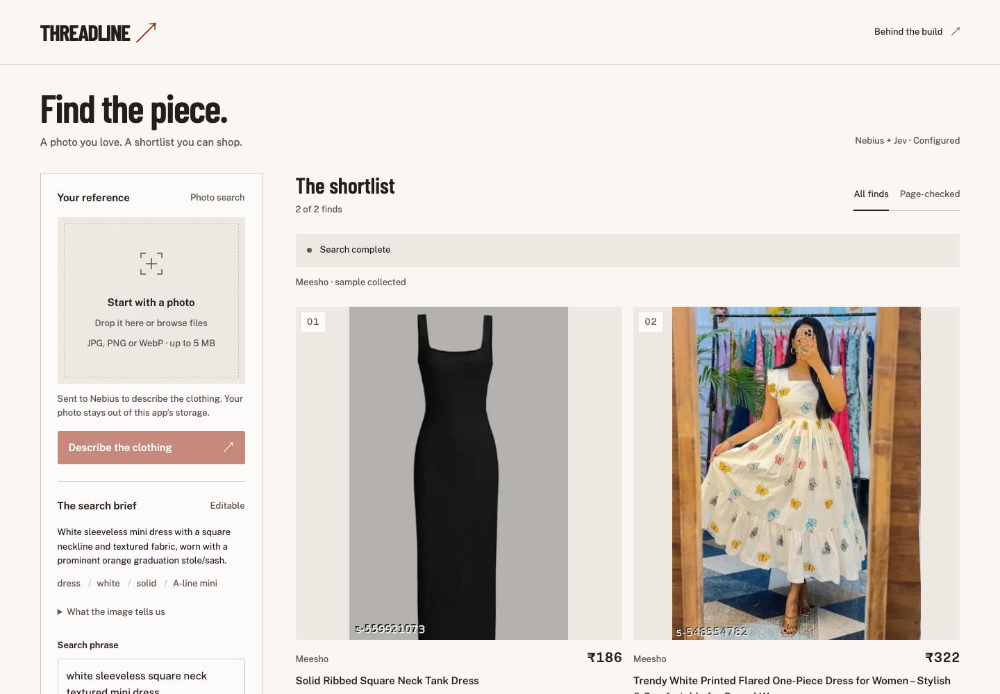
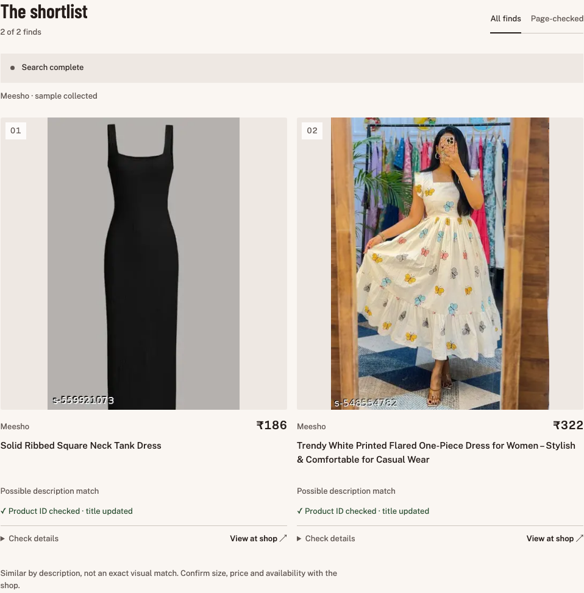

# Threadline ↗

### See a look. Find similar clothing across shops.

Upload a clothing photo, review the description, and watch a real Chrome browser search for similar products. **Nebius handles image understanding. TypeSafe Jev chooses browser actions and judges relevance.** Product titles, images, prices and links come from observed shop pages.

**Built from [Hearth](https://github.com/Nancy-Chauhan/hearth-jev-rental-search) by [Nancy Chauhan](https://github.com/Nancy-Chauhan)**, using [Jev Ultrafast](https://github.com/browser-use/jev-ultrafast) by Browser Use. Nancy’s visible, multi-site rental-search demo inspired this clothing-search adaptation. See [Credits](#credits-and-license).



## The shopping studio

The interface follows [Hallmark](https://github.com/Nutlope/hallmark) and Impeccable design guidance: a compact reference panel beside a photo-led shortlist, Barlow Condensed + Public Sans, warm neutral surfaces and rust actions. Use **All finds / Page-checked** to filter evidence. Expand **Behind the search** for the real browser capture and Jev decision log. On phones, section links jump between the reference and the shortlist.

## See it in action

These screenshots show the actual local app after a live run; they are not mockups.



In the recorded test, the existing image description was **a white sleeveless mini dress with a square neckline and textured fabric**. The image-analysis result was reused; shopping searches and Jev calls were fresh.

| Shop | Observed candidates | Final shortlist | Product-page evidence |
| --- | ---: | ---: | --- |
| Amazon India | 9 | 7 | 3 retained matches page-checked |
| Meesho, separate run | 20; first 16 scored | 2 | 3 pages checked; Jev retained 2 after reassessment |

The useful part: Meesho search cards used generic names. After opening the pages, Threadline found more descriptive titles, passed that evidence back to Jev, and dropped one candidate. The retained products had observed page prices of ₹186 and ₹322 at test time. Those are historical observations, not current offers.

- [Sanitized live-run evidence](docs/threadline/live-run.json): real action events and retained products, without credentials, screenshots or local paths.
- [Validation notes](docs/threadline-validation.md): test scope, failures and limitations.
- An earlier combined run hit a Jev connection failure on Meesho. The separate Meesho run succeeded. This is a working prototype, not a reliability benchmark.

## How it works

```mermaid
flowchart LR
    A[Clothing photo] --> B[Nebius vision description]
    B --> C[Review search phrase]
    C --> D[Jev browser decisions]
    D --> E[Real Chrome search]
    E --> F[Extract observed product cards]
    F --> G[Jev relevance choices]
    G --> H[Open top 3 product pages per shop]
    H --> I[Check product identity and read details]
    I --> J[Jev reassesses page evidence]
    J --> K[Shortlist with evidence labels]
```



### What Jev actually does

- **Browser decisions:** selects an operation and an observed target using typed choice heads in one fan-out request. The executor consumes the target for the selected operation.
- **Search input:** selects the user-reviewed query for an observed search field.
- **Relevance:** labels each observed candidate `strong`, `possible` or `unrelated` using independent choice heads in a batch.
- **Reassessment:** judges the detailed product-page description again; a plausible search card can still be rejected.

Jev does not generate product URLs, prices, selectors or executable code. Deterministic code extracts cards, checks product IDs and executes supported actions. Nebius handles the uploaded image. Matching is description-to-text, not a pixel-level comparison against every product photo.

### Product evidence

Card adapters isolate Amazon, Meesho and Myntra products. Containers containing multiple product identities are rejected to avoid mixing neighboring titles and prices. Tracking links are deduplicated by product ID, images survive duplicate merging, and conflicting card prices are withheld.

The top three relevant products per shop receive a bounded page check. Redirects to another product are rejected. Generic card titles can be replaced with the page’s detailed title before Jev reassesses relevance. Blocked or unreadable pages remain explicitly unverified. Remaining candidates carry **card evidence only** labels.

## Run locally

### Prerequisites

- Python 3.12+ and [uv](https://docs.astral.sh/uv/).
- Google Chrome, using a dedicated signed-out profile.
- A [Nebius Token Factory](https://tokenfactory.nebius.com/) API key with access to the configured vision model.
- A [TypeSafe](https://docs.typesafe.ai/introduction) API key for Jev.
- Node.js only if you want to run the JavaScript tests.

```bash
git clone https://github.com/shivaylamba/threadline-jev-shopping.git
cd threadline-jev-shopping
uv sync
cp .env.example .env
```

Set these values in `.env`:

```dotenv
NEBIUS_API_KEY=your_nebius_key
NEBIUS_BASE_URL=https://api.tokenfactory.nebius.com/v1
NEBIUS_VISION_MODEL=deepseek-ai/DeepSeek-V4.1-Flash
TYPESAFE_API_KEY=your_typesafe_key
TYPESAFE_MODEL=jev-latest
BU_CDP_URL=http://127.0.0.1:9224
```

The vision model ID reflects the tested account configuration. Your account must have access and support image inputs. The app does not silently substitute a different model. Provider calls may incur charges. Credentials stay on the local server; `.env` is ignored by Git.

Start a separate Chrome instance from the project directory.

**macOS**

```bash
open -na 'Google Chrome' --args --remote-debugging-port=9224 \
  --user-data-dir="$PWD/.chrome-profile" \
  --no-first-run --no-default-browser-check about:blank
```

**Linux**

```bash
google-chrome --remote-debugging-port=9224 \
  --user-data-dir="$PWD/.chrome-profile" \
  --no-first-run --no-default-browser-check about:blank
```

Then start the app:

```bash
uv run threadline
```

Open **http://127.0.0.1:8768/**. Upload a JPEG, PNG or WebP under 5 MB, choose **Describe this garment**, review the phrase, select Amazon or Meesho, then choose **Find similar clothing**. Watch the dedicated Chrome window or the app’s browser view and action log.

For another app port, set it in the launching shell: `WARDROBE_PORT=8769 uv run threadline`. The app is loopback-only and requires the local Chrome process; it is not a static website deployment.

## Supported sources and current limits

| Source | Status |
| --- | --- |
| Amazon India | End-to-end browser search, extraction and sampled page checks live-tested |
| Meesho | End-to-end browser search, extraction and sampled page checks live-tested |
| Myntra | Adapter implemented; not live-verified |
| Google | Direct links to supported retailers handled; carousel-only entries and other retailer domains unsupported |

- Searches sample candidates: up to 16 browser decisions per source and 16 candidates scored. The app is not an exhaustive catalog search.
- A strong text match does **not** prove the exact same garment. Page checks do not confirm size, inventory, delivery or visual identity.
- Prices are observations. If no page price is extracted, the card price remains explicitly unconfirmed on the product page.
- Retailer layout changes, CAPTCHA/access blocks and provider connection failures can interrupt runs. Access challenges are reported, not bypassed.
- Shops run sequentially in one owned browser tab. Verification adds page loads; model latency is shown separately from total search time.
- No purchases, cart additions, account creation, messages or credential entry. Action filtering reduces risk but is not a general security boundary against every ambiguous site control.
- Stop prevents subsequent work after an in-flight call returns; it cannot undo an already-issued action.
- Uploaded photos are sent to Nebius and retained only in app memory. Provider policies are separate. Browser cache/history remain in the dedicated profile. Do not publish `.env`, profiles or private run artifacts.

## Development

```bash
uv run ruff check .
uv run pytest
node --check jev_ultrafast/wardrobe_static/app.js
node --check jev_ultrafast/products.js
node --check jev_ultrafast/product_detail.js
node --check jev_ultrafast/static/app.js
node --check jev_ultrafast/static/report.js
node --check jev_ultrafast/static/query.js
node --check jev_ultrafast/static/telemetry.js
node --test tests/report.test.js tests/query.test.js tests/telemetry.test.js
uv build
```

Optional browser extraction fixtures: install Playwright outside the Python environment (or make it available through `NODE_PATH`), install its Chromium browser, then run `node tests/products.browser.cjs`. Requests in these fixtures are intercepted locally; they do not call retailers or paid model APIs.

Validated at publication: **78 Python tests**, **52 inherited JavaScript tests**, browser extraction fixtures, Ruff, syntax checks and package build. Live checks are documented separately from offline tests.

| File | Responsibility |
| --- | --- |
| `jev_ultrafast/wardrobe.py` | Local server, cancellation, source orchestration |
| `jev_ultrafast/fashion.py` | Vision contract, deduplication, verification, Jev relevance |
| `jev_ultrafast/products.js` | Read-only product-card extraction |
| `jev_ultrafast/product_detail.js` | Read-only product-page evidence |
| `jev_ultrafast/wardrobe_static/` | Threadline interface |
| `jev_ultrafast/agent.py`, `browser.py`, `model.py` | Inherited and adapted Jev browser execution loop |

## Credits and license

**Thank you to [Nancy Chauhan](https://github.com/Nancy-Chauhan) for [Hearth](https://github.com/Nancy-Chauhan/hearth-jev-rental-search).** This repository is an adaptation of her rental-search project, not an independently created browser-agent foundation. Hearth’s visible multi-site search workflow is the starting point for Threadline. Its original README is preserved in [HEARTH.md](HEARTH.md), and upstream Git history is retained.

- [Browser Use — Jev Ultrafast](https://github.com/browser-use/jev-ultrafast): underlying fast, typed browser-action architecture.
- [TypeSafe](https://docs.typesafe.ai/patterns/fan-out): Jev decision and relevance inference.
- [Nebius Token Factory](https://tokenfactory.nebius.com/): clothing-image understanding.
- **Threadline adaptation:** image-led shopping flow, shop extraction, product verification, relevance reassessment and clothing-search interface by [Shivay Lamba](https://github.com/shivaylamba).

MIT licensed. The original Browser Use copyright and license notice are preserved in [LICENSE](LICENSE). Historical Hearth/flight demos under `docs/`, `scripts/` and `examples/` belong to the inherited project; the Threadline screenshots and evidence live under `docs/threadline/`.
